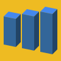
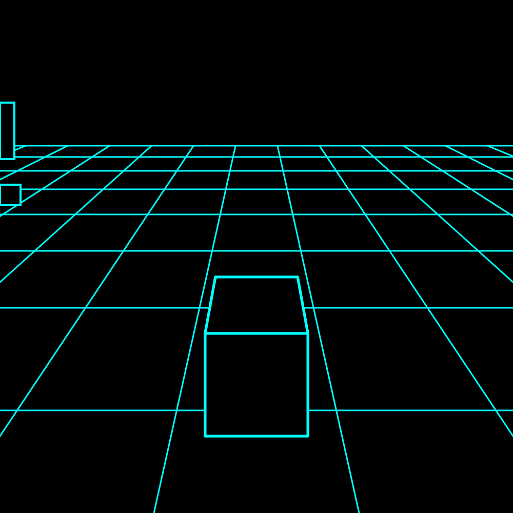
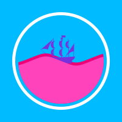
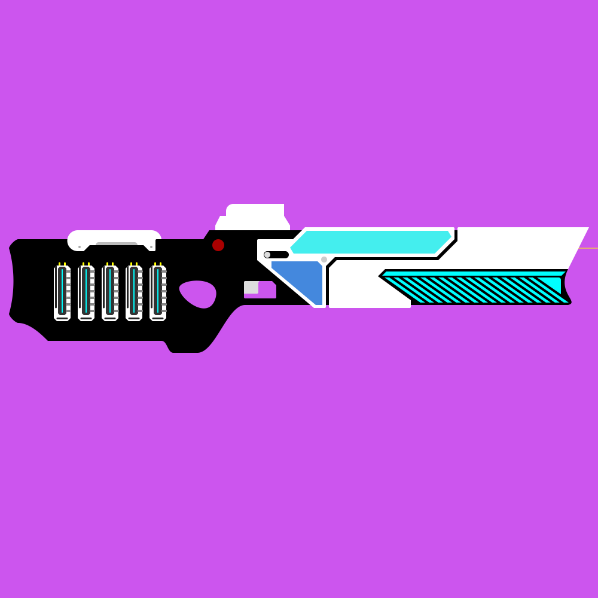
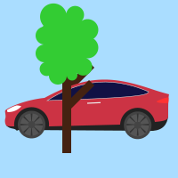

# SVG-Collections
SVG (Scalable Vector Graphics)

| Scalable | Vector | Graphics |
|:-:|:-:|:-:|
|<a href="image/Cube.svg"> Cube.svg</a>|<a href="image/Transformer.svg"> Transformer.svg</a>|<a href="image/Diamond.svg"> Diamond.svg</a>
|<a href="image/Bar3D.svg"> Bar3D.svg</a>|<a href="image/Graph.svg"> Graph.svg</a>|<a href="image/Heartbeat.svg"> Heartbeat.svg</a>
|<a href="image/Cyan.svg"> Car.svg</a>|<a href="image/Radar.svg"> Radar.svg</a>|<a href="image/Engine.svg"> Engine.svg</a>
|<a href="image/Flood.svg"> Flood.svg</a>|<a href="image/Science.svg"> Science.svg</a>|<a href="image/Hourclock.svg"> Hourclock.svg</a>
|<a href="image/Rifle.svg"> Rifle.svg</a>|<a href="image/Pacman.svg"> Pacman.svg</a>|<a href="image/Movie.svg"> Movie.svg</a>
|<a href="image/Car.svg"> Car.svg</a>

# Loadings
| 1 | 2 | 3 | 4 |
|:-:|:-:|:-:|:-:|
|  |  |  |  |
|  |  |  |  |

